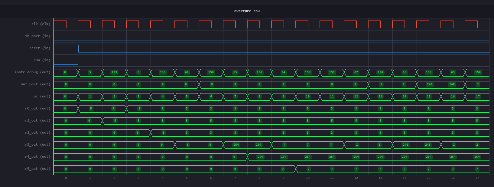
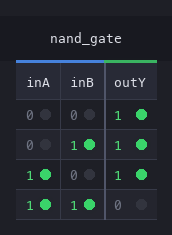
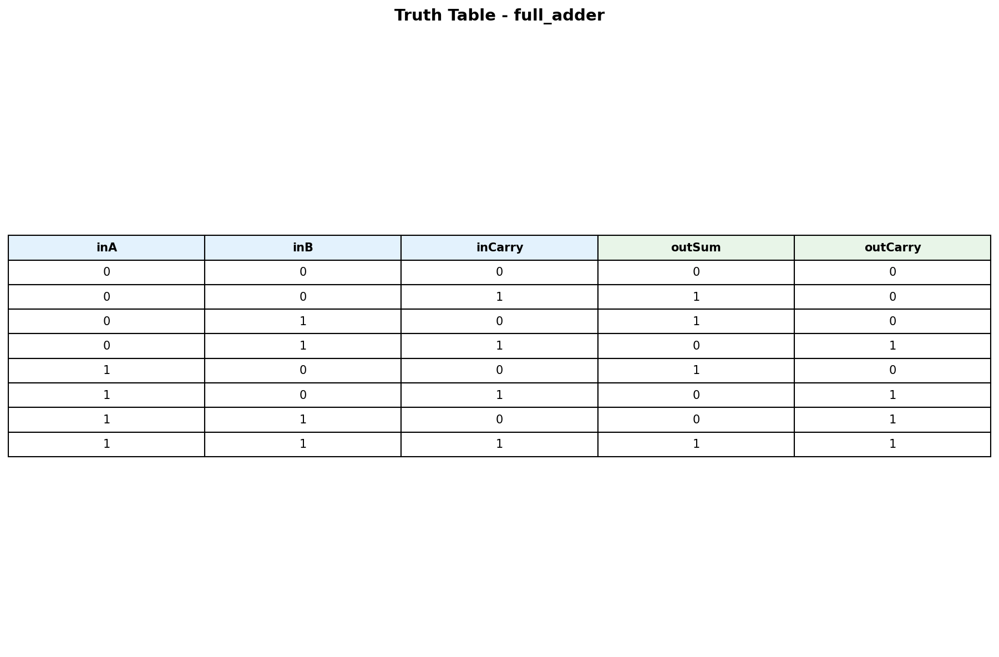
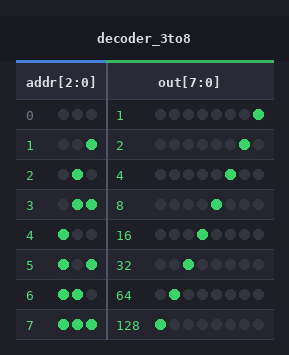

# PySVSim - SystemVerilog Simulator

A pure Python SystemVerilog simulator designed for an educational digital logic game. Players design hardware modules from NAND gates up to CPUs. The simulator parses SystemVerilog, evaluates logic, generates truth tables/waveforms, and validates designs against test cases.

## Project Status

| Metric | Value |
|--------|-------|
| Last Verified | February 11, 2026 |
| `parts/basic/` | 44/44 files, 416/416 tests |
| `parts/overture/` | 41/41 files, 325/325 tests |
| `parts/testing/` | 40/40 files, 261/261 tests |
| **Combined** | **125 files, 1002 tests, all passing** |
| Total NAND Gates | 21,835 |

## Example Output

### Waveform - Overture CPU Execution



### Waveform - 8-bit Counter with Reset/Enable


### Truth Tables

| NAND Gate | Full Adder | 3-to-8 Decoder |
|:---------:|:----------:|:--------------:|
|  |  |  |

## Quick Start

```bash
# Generate truth table for a module
uv run pysvsim.py --file parts/basic/full_adder.sv

# Run with test cases
uv run pysvsim.py --file parts/basic/full_adder.sv --test parts/basic/full_adder.json

# Test a single file
uv run test_runner.py parts/basic/and_gate.sv

# Test a subdirectory or entire tree (parallel)
uv run test_runner.py parts/basic/
uv run test_runner.py parts/overture/
uv run test_runner.py parts/          # all subdirectories
```

## Features

### Core Simulation
- **Pure Python**: Dependencies: `matplotlib` (waveforms), `Pillow` (truth tables)
- **Bus Support**: Multi-bit buses (`input [7:0] data`), bit selection (`A[2]`), slices (`bus[7:4]`)
- **Hierarchical Design**: Module instantiation with bit selection (`.A(data[0])`)
- **Combinational Logic**: Bitwise operators, arithmetic (`+`, `-`, `*`), ternary (`sel ? a : b`)
- **`always_comb` Blocks**: Procedural blocks with `if/else` and `case/default`
- **Sequential Logic**: `always_ff @(posedge clk)`, registers, counters, clock/enable/reset
- **ROM Primitives**: `rom_*` modules auto-load data files by naming convention
- **Memory Arrays**: `reg/logic [W] mem [D]` for ROM/RAM-style modules
- **NAND Gate Analysis**: Counts NAND gates through hierarchical designs for complexity scoring

### Testing & Visualization
- **Truth Table Generation**: Automatic truth tables for combinational logic
- **Waveform Generation**: Timing diagrams for sequential logic
- **Image Output**: PNG images for game integration
- **JSON Testing**: Test cases for combinational and sequential designs
- **Parallel Test Runner**: Multi-core regression testing

## Directory Structure

```
pysvsim/
├── pysvsim.py              # Main simulator
├── test_runner.py           # Parallel test runner
├── parts/
│   ├── basic/              # 44 core building blocks
│   │   ├── nand_gate.sv    #   gates, adders, muxes, registers,
│   │   ├── full_adder.sv   #   counters, decoders, ALU, ROM,
│   │   ├── regfile_8x8.sv  #   carry-select adders (up to 64-bit)
│   │   └── ...
│   ├── overture/           # 41 Overture CPU modules
│   │   ├── overture_cpu.sv #   CPU core (structural instantiation)
│   │   ├── overture_alu_8bit.sv
│   │   ├── overture_decoder_8bit.sv
│   │   ├── overture_fetch.sv
│   │   ├── pgm_*.sv        #   9 program harness wrappers
│   │   └── ...
│   ├── testing/            # 40 HDLBits coursework + validation modules
│   │   ├── 001-GettingStarted.sv
│   │   ├── ...
│   │   └── memory_cpu_stub.sv
│   └── roms/               # Blank ROM templates
├── goals/                   # Milestone documents
│   ├── goal-1-overture_cpu_isa_reference.md
│   ├── goal-2-advanced-8bitcpu-milestone.md
│   ├── goal-3-rv32i-milestone.md
│   └── research/           # ISA research reports
└── results/                 # Test result output files
```

## Module Library (`parts/basic/`)

All modules are built hierarchically from NAND gates.

### Logic Gates
| Module | 1-bit | 8-bit |
|--------|-------|-------|
| NAND | `nand_gate` | `nand_gate_8bit` |
| AND | `and_gate` | `and_gate_8bit` |
| OR | `or_gate` | `or_gate_8bit` |
| NOR | `nor_gate` | `nor_gate_8bit` |
| XOR | `xor_gate` | `xor_gate_8bit` |
| XNOR | `xnor_gate` | `xnor_gate_8bit` |
| NOT | `not_gate` | `not_gate_8bit` |

### Arithmetic
| Module | NAND Gates |
|--------|------------|
| Half Adder | 6 |
| Full Adder | 15 |
| 4-bit Adder | 60 |
| 8-bit Adder | 120 |
| 16-bit Adder | 240 |
| 32-bit Adder | 480 |
| 64-bit Adder | 960 |
| 8-bit Carry-Select | 220 |
| 16-bit Carry-Select | 732 |
| 32-bit Carry-Select | 2,332 |
| 64-bit Carry-Select | 7,260 |

### Data Path
| Module | Variants |
|--------|----------|
| 2:1 Mux | 1, 4, 8, 16, 32-bit |
| 4:1 Mux | 8-bit (gate-level), 8-bit (`always_comb`) |
| 8:1 Mux | 8-bit |
| Ternary Mux | 8-bit (ternary operator) |
| Decoder | 3-to-8 |
| Register | 1, 8, 16, 32, 64-bit |
| Register File | 8x8 (dual read ports, 939 NANDs) |
| Counter | 8-bit with reset/enable |
| ALU | 8-bit (`always_comb`, 4 ops: AND, OR, XOR, NOT) |

### ROM Primitives
| Module | Description |
|--------|-------------|
| `rom_deadbeef` | 4x8 ROM (demo) |

ROM modules use a naming convention: `rom_{name}` auto-loads `{name}.txt`.

## Overture CPU (`parts/overture/`)

An 8-bit CPU implementing the Overture ISA with structural sub-module instantiation.

### CPU Sub-modules
| Module | Role |
|--------|------|
| `overture_cpu` | Top-level CPU (448 NAND gates via mux tree) |
| `overture_fetch` | Combinational ROM wrapper for instruction memory |
| `overture_decoder_8bit` | Instruction field decoder (immediate/calculate/copy/condition) |
| `overture_alu_8bit` | ALU with OR, NAND, NOR, AND, ADD, SUB operations |
| `overture_condition` | Branch condition evaluator (8 conditions) |
| `overture_pc_8bit` | Program counter with jump/load |
| `mux_8to1_8bit` | 8:1 register select mux |

### Program Harnesses (`pgm_*`)
Each `pgm_{name}` module wraps `overture_cpu` with a dedicated ROM program:

| Program | Description |
|---------|-------------|
| `pgm_overture_add5` | Adds 5 to input |
| `pgm_overture_alu` | ALU smoke test |
| `pgm_overture_branch` | Branch instruction test |
| `pgm_overture_io` | I/O and condition codes |
| `pgm_overture_laser` | Multiply by 6 (laser power) |
| `pgm_overture_invasion` | Enemy detection (shoot/move) |
| `pgm_overture_cracker` | Sequential counter output |
| `pgm_overture_masking` | Bitwise AND masking |
| `pgm_overture_maze` | Maze navigation (left-wall follower) |

## Test File Format

JSON test files share the same base name as the SystemVerilog file.

### Combinational
```json
[
    {"inA": 0, "inB": 0, "expect": {"outY": 1}},
    {"inA": 1, "inB": 1, "expect": {"outY": 0}}
]
```

### Sequential
```json
{
    "sequential": true,
    "test_cases": [
        {
            "name": "Reset behavior",
            "sequence": [
                {"inputs": {"clk": 1, "reset": 1}, "expected": {"count": 0}},
                {"inputs": {"clk": 1, "reset": 0, "enable": 1}, "expected": {"count": 1}}
            ]
        }
    ]
}
```

## SystemVerilog Support

### Supported
- Module declarations with input/output ports
- Buses: `input [7:0] A`, `wire [3:0] temp`
- Bit selection: `A[2]`, `bus[7:4]`
- Concatenation: `{a, b}`, `{4{bit}}`
- Bitwise operators: `&`, `|`, `^`, `~`
- Arithmetic in assign statements: `+`, `-`, `*`
- Ternary operator: `assign out = sel ? a : b` (nested right-associative)
- Literals: `1'b0`, `8'hFF`, `4'd10`
- `always_comb` blocks with `if/else` and `case/default`
- `always_ff @(posedge clk)` blocks with `if/else` and `case/default`
- Blocking (`=`) and nonblocking (`<=`) assignment
- Memory arrays: `reg [7:0] memory [255:0]`
- ROM primitives: `rom_*` modules auto-load data files

### Limitations
- Modules must be in same directory as parent
- No timing/propagation delays
- No event-driven simulation (cycle-based stepping only)

## Goal Readiness

Three progressive CPU milestones. See `goals/` for detailed plans.

| | Goal 1: Overture | Goal 2: LEG | Goal 3: RV32I |
|---|---|---|---|
| **Status** | Complete | Planned | Planned |
| **Description** | 8-bit CPU, 8-bit instructions | 8-bit CPU, 32-bit instructions | 32-bit RISC-V CPU |
| **Reference** | `goal-1-overture_cpu_isa_reference.md` | `goal-2-advanced-8bitcpu-milestone.md` | `goal-3-rv32i-milestone.md` |
